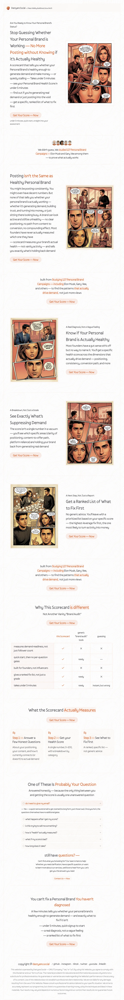
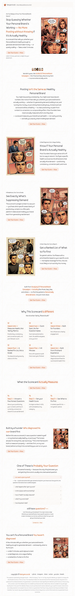
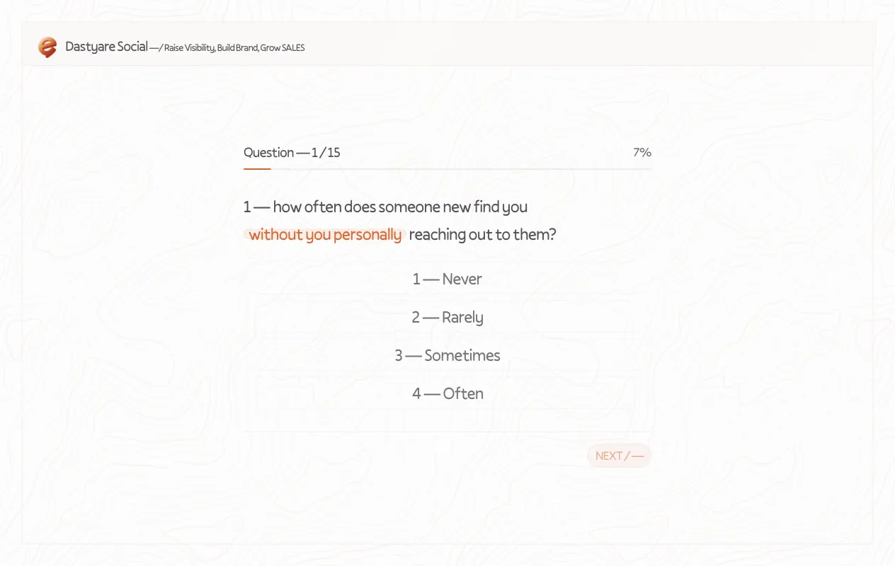
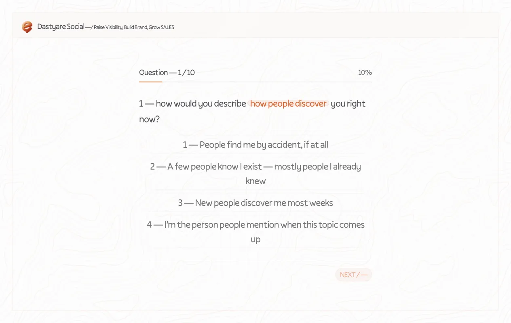
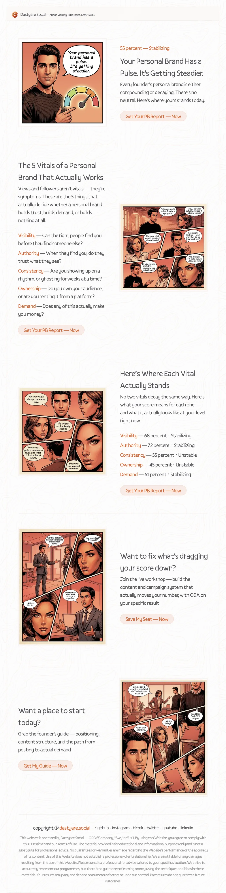

# Dastyare Social — Score Card

An interactive quiz that scores how well a personal brand generates demand and reveals a personalised result, with a registration funnel attached.

## Completed work

Everything that has been set up / done on this project so far:

- **Pages** — A/B landing (`/v1`, `/v2`), questions (`/questions/v1`, `/questions/v2`), score result (`/score/v1`, `/score/v2`). A server-side `/` redirect picks a landing variant based on the PostHog flag `home-page-variant` (cookie `home_ab_variant`, fallback `/v1`).
- **Full-page screenshots** — captured for every page/variant, compressed to WebP q80, and committed under `screenshots/` (see tables below).
- **PostHog analytics** — consent-gated (`posthog_consent` cookie), session replay with full text/attribute masking, scroll depth, button/link/outbound-click tracking, plus the quiz + registration funnel events. (This project has **no** dedicated `POSTHOG.md`; the shared event/tracking setup mirrors the [workshop](https://github.com/omidshabab/dastyare_social_workshop)/[magnet](https://github.com/omidshabab/dastyare_social_magnet) sites.)
- **PostHog dashboard** — `Score Card — Dastyare Social` (see below) with the funnel insights and a weekly email subscription. Shares the same PostHog project as the workshop/magnet sites; its insights are isolated by filtering on `$host`.
- **Shared A/B experiment** — reuses `Home page A/B test` (PostHog experiment, flag `home-page-variant`, variants `v1`/`v2`, 50/50, 100% rollout) shared with the workshop and magnet sites.

### PostHog dashboard (as configured)

The dashboard **Score Card — Dastyare Social** ([open](https://us.posthog.com/project/103916/dashboard/2041975)) is filed in the **Score Card** folder ([`Unfiled/Score Card`](https://us.posthog.com/project/103916/dashboards)). All three insights are filtered to the quiz host (`$host = quiz.dastyare.social`):

| Insight | Type | Steps |
| --- | --- | --- |
| Score Card — Registration funnel (`11416605`) | Funnel (14-day), `$host` filtered | `landing_page_viewed` → `registration_cta_clicked` → `registration_form_continue` → `registration_form_submit_success` → `confirmation_page_viewed` |
| Score Card — Quiz & registration journey (`11416606`) | Funnel (14-day), `$host` filtered | `landing_page_viewed` → `questions_page_viewed` → `score_result_viewed` → `registration_form_submit_success` |
| Score Card — CTA performance by section (`11416607`) | Funnel (14-day), `$host` filtered, broken down by `cta_location` | `registration_cta_clicked` → `registration_form_submit_success` |

A weekly email subscription (`137975`, "Score Card weekly — Dastyare Social") exports all three insights to `iamomidshabab@gmail.com` every Monday (AI summary emphasising the quiz-completion → registration conversion and where users drop off across landing → questions → score → registration).

> **Note on folders:** folders in PostHog can only be created/moved via the browser UI — no API key type (personal or project) has `file_system:write` scope, and the dashboard serializer has no writable `folder` field. This was confirmed against the OpenAPI spec; objects (dashboards/insights/funnels) are created via API, folders are organised in the UI.

## Landing
Routes: `/v1`, `/v2`

<table>
  <tr>
    <th>v1 — <code>/v1</code></th>
    <th>v2 — <code>/v2</code></th>
  </tr>
  <tr>
    <td></td>
    <td></td>
  </tr>
</table>

## Questions
Routes: `/questions/v1`, `/questions/v2`

<table>
  <tr>
    <th>v1 — <code>/questions/v1</code></th>
    <th>v2 — <code>/questions/v2</code></th>
  </tr>
  <tr>
    <td></td>
    <td></td>
  </tr>
</table>

## Score
Routes: `/score/v1`, `/score/v2`

<table>
  <tr>
    <th>v1 — <code>/score/v1</code></th>
    <th>v2 — <code>/score/v2</code></th>
  </tr>
  <tr>
    <td></td>
    <td></td>
  </tr>
</table>
